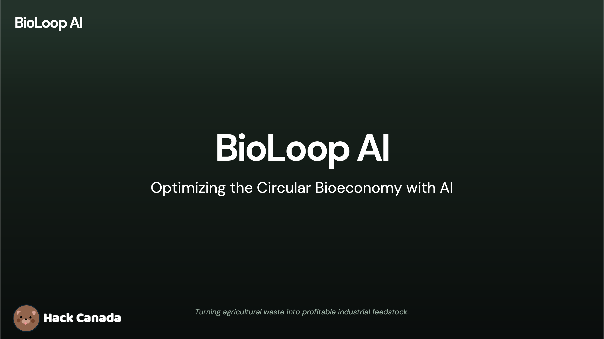

# BioLoop AI – Full-Stack MVP



AI-powered circular bioeconomy platform. Connects farm biomass supply with industrial demand using a real API, optimizer, and AI explanations.

## File structure

```
BioLoopAI/
├── backend/            # Express + Prisma + Python optimizer + Ollama explainer
├── index.html          # Landing: hero + "Launch Dashboard" CTA
├── login.html          # Login (email, password)
├── signup.html         # Sign up (email, password, confirm password)
BioLoopAI/
├── backend/            # Express + Prisma + Python optimizer + Ollama explainer
├── index.html          # Landing: hero + "Launch Dashboard" CTA
├── login.html          # Login (email, password)
├── signup.html         # Sign up (email, password, confirm password)
├── dashboard.html      # Unified role-adaptive dashboard
├── css/
│   └── styles.css      # Global styles (climate-tech, responsive)
├── js/
│   ├── auth.js         # Auth: login, signup, JWT guard
│   ├── dashboard.js    # Entry: load data, impact cards, table, forms, sliders
│   ├── map.js          # Leaflet map: farms, industries, connection lines
│   ├── charts.js       # Chart.js: biomass by type, revenue by industry
│   └── ai-insights.js  # AI insights panel (Ollama)
└── README.md
```

## Run locally

1) **Backend**
```bash
cd backend
cp .env.example .env
npm install
npx prisma generate
npx prisma db push
npm run dev
```

2) **Frontend** (static server)

ES modules require a real server (no `file://`). From project root:

```bash
# Python 3
python3 -m http.server 8080

# Node (npx)
npx serve -p 8080
```

Then open **http://localhost:8080**

- **Landing:** http://localhost:8080/index.html  
- **Login:** http://localhost:8080/login.html  
- **Sign up:** http://localhost:8080/signup.html  
- **Dashboard:** http://localhost:8080/dashboard.html

The frontend expects the backend at `http://localhost:3000` by default. Override with `?apiBase=http://host:port` or by setting `localStorage` key `bioloop_api_base`.

## Auth

- Signup includes a role selector (Farm manager or Industry manager).
- Login/signup call the API and store a real JWT in `localStorage`.
- Dashboard checks for `bioloop_jwt` in `localStorage`; if missing, redirects to `login.html`.
- Log out clears the token and sends you to login.

## Tech stack

- HTML, CSS, JavaScript (ES6 modules)
- Chart.js (charts)
- Leaflet (map)
- Express + Prisma (SQLite)
- Python (PuLP optimizer, Ollama explainer)
