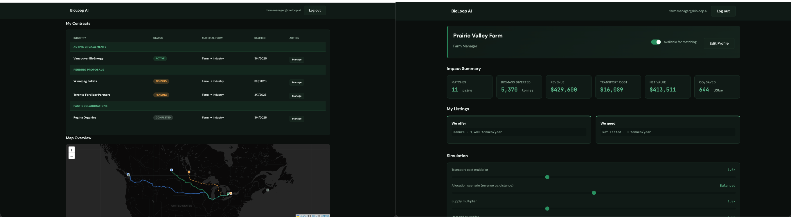
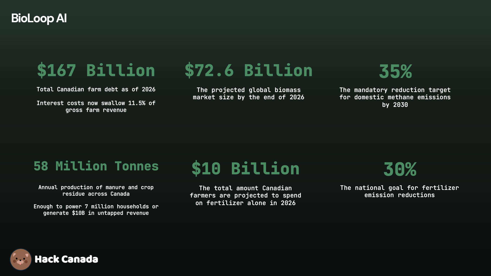

### The Problem: A Sector Under Pressure
Canadian agriculture is currently at a crossroads. As of 2026, farm debt has climbed to $167 billion, and interest costs now swallow 11.5% of gross revenue. At the same time, the sector is responsible for 10% of Canada’s total GHG emissions, primarily from methane and fertilizer use.

For years, 58 million tonnes of annual biomass (manure and crop residue) have been treated as a disposal problem. But in 2026, waste is a policy failure we can no longer afford.



### The Solution: BioLoop AI
BioLoop AI is an optimization marketplace that connects the "waste" of the farm to the "feedstock" of the future. We use AI to solve the logistics of the circular economy, ensuring that every biomass exchange is profitable for the farmer and efficient for the buyer.

### The Alignment: Meeting Canada’s 2030 Goals
BioLoop AI is purpose-built to help Canada hit its high-stakes environmental targets:

- The Methane Challenge: Canada has committed to a 35% reduction in domestic methane emissions by 2030. BioLoop AI diverts manure into anaerobic digesters, preventing methane from venting into the atmosphere.

- The Clean Fuel Mandate: Under the Clean Fuel Regulations (CFR), fuel suppliers must reduce the carbon intensity of their products by 15% by 2030. BioLoop AI provides the domestic, low-carbon feedstock needed to produce the 8.5 billion litres of biofuels Canada requires to meet this goal.

- Fertilizer Emissions: Canada is aiming for a 30% reduction in emissions from fertilizer. By facilitating the exchange of processed organic digestate back to farms, BioLoop AI replaces synthetic nitrogen with circular, bio-based alternatives.

- Zero Waste Vision: We directly support the national goal of diverting 75% of organic waste from landfills by 2030, turning "trash" into a strategic industrial asset.

### The Opportunity: Profit Meets Policy
In 2026, sustainability is no longer an "extra"—it is the baseline for farm profitability. BioLoop AI transforms environmental compliance into a secondary income stream, potentially swinging a farm's annual bottom line by $35,000 or more.

We aren't just building a marketplace; we are building the infrastructure for a Net-Zero 2050.

## File structure

```
BioLoopAI/
├── backend/            # Express + Prisma + Python optimizer + Ollama explainer
├── index.html          # Landing: hero + "Launch Dashboard" CTA
├── login.html          # Login (email, password)
├── signup.html         # Sign up (email, password, confirm password)
BioLoopAI/
├── backend/            # Express + Prisma + Python optimizer + Ollama explainer
├── index.html          # Landing: hero + "Launch Dashboard" CTA
├── login.html          # Login (email, password)
├── signup.html         # Sign up (email, password, confirm password)
├── dashboard.html      # Unified role-adaptive dashboard
├── css/
│   └── styles.css      # Global styles (climate-tech, responsive)
├── js/
│   ├── auth.js         # Auth: login, signup, JWT guard
│   ├── dashboard.js    # Entry: load data, impact cards, table, forms, sliders
│   ├── map.js          # Leaflet map: farms, industries, connection lines
│   ├── charts.js       # Chart.js: biomass by type, revenue by industry
│   └── ai-insights.js  # AI insights panel (Ollama)
└── README.md
```

## Run locally

1) **Backend**
```bash
cd backend
cp .env.example .env
npm install
npx prisma generate
npx prisma db push
npm run dev
```

2) **Frontend** (static server)

ES modules require a real server (no `file://`). From project root:

```bash
# Python 3
python3 -m http.server 8080

# Node (npx)
npx serve -p 8080
```

Then open **http://localhost:8080**

- **Landing:** http://localhost:8080/index.html  
- **Login:** http://localhost:8080/login.html  
- **Sign up:** http://localhost:8080/signup.html  
- **Dashboard:** http://localhost:8080/dashboard.html

The frontend expects the backend at `http://localhost:3000` by default. Override with `?apiBase=http://host:port` or by setting `localStorage` key `bioloop_api_base`.

## Auth

- Signup includes a role selector (Farm manager or Industry manager).
- Login/signup call the API and store a real JWT in `localStorage`.
- Dashboard checks for `bioloop_jwt` in `localStorage`; if missing, redirects to `login.html`.
- Log out clears the token and sends you to login.

## Tech stack

- HTML, CSS, JavaScript (ES6 modules)
- Chart.js (charts)
- Leaflet (map)
- Express + Prisma (SQLite)
- Python (PuLP optimizer, Ollama explainer)

## Credits

- Made for **Hack Canada 2026**  
- Built **solo** by **Jishnu**  
- AI-assisted development: used generative AI for code scaffolding, frontend design, and prototyping  
- Screenshots and demo data are for hackathon purposes  

## Disclaimer

This project is a **base MVP**. It will be improved in the future, with more modules and features added. This serves as the **foundation** for BioLoop AI.

## Concept & License

- The concept, design, and implementation of BioLoop AI are **original and proprietary**.  
- Copyright (c) 2026 Jishnu Setia. All rights reserved.  
- This code and concept **is not permitted to be copied, modified, reused, or redistributed** without explicit permission.